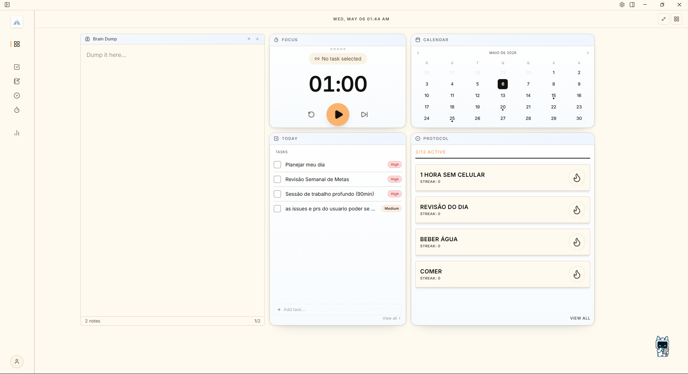

# Axis Desktop

Axis Desktop is a cross-platform personal productivity desktop app built with **Tauri v2**, **React 19**, **TypeScript**, and **Rust**. The project combines tasks, habits, Pomodoro, notes, calendar, and analytics into a native-feeling workspace with a strong emphasis on architecture, performance, and type safety.

## Overview

- Dashboard-oriented productivity app with modular widgets and dedicated pages
- Native desktop shell via Tauri with platform-aware menus, shortcuts, notifications, and updates
- SQLite-backed local data for productivity domains such as habits, Pomodoro, and layout state
- Architecture and tooling designed for maintainable long-term development, including AI-assisted workflows

## Dashboard Preview



## Product Areas

- **Dashboard**: customizable grid with widget visibility and persisted layout
- **Habits**: creation, completion logging, streak tracking, and overview analytics
- **Pomodoro**: focus session tracking and persisted timer settings
- **Analytics**: summary cards and historical productivity signals
- **Notes and planning surfaces**: app structure already includes notes, kanban, calendar, and related commands/pages
- **Quick Pane**: floating window accessible by global shortcut for fast interaction outside the main window

## Architecture

- **Frontend**: React 19, TypeScript, Vite 8, Tailwind CSS 4, shadcn/ui 4
- **Desktop layer**: Tauri v2 with a typed Rust <-> TypeScript bridge generated through `tauri-specta`
- **State model**: `useState` for local UI, Zustand for global UI state, TanStack Query for persistent/server-like data
- **Persistence**: Rust commands plus local SQLite and app storage
- **Quality gates**: ESLint, Prettier, ast-grep, Vitest, `cargo fmt`, and `cargo clippy`

## Tech Stack

| Layer               | Technologies                                  |
| ------------------- | --------------------------------------------- |
| Frontend            | React 19, TypeScript, Vite 8                  |
| UI                  | Tailwind CSS 4, shadcn/ui 4, Radix UI, Lucide |
| State               | Zustand 5, TanStack Query 5                   |
| Motion and visuals  | Motion, GSAP, Recharts, React Grid Layout     |
| Desktop and backend | Tauri v2, Rust, SQLx, SQLite                  |
| Tooling             | Bun, ESLint, Prettier, ast-grep, Vitest       |

## Development

### Prerequisites

- [Bun](https://bun.sh/)
- [Rust](https://rustup.rs/)
- Platform-specific Tauri system dependencies
  See [Tauri prerequisites](https://tauri.app/start/prerequisites/)

### Setup

```bash
git clone https://github.com/Gabriel-Leall/axis-desktop.git
cd axis-desktop
bun install
```

### Common Commands

```bash
bun run dev           # Frontend dev server
bun run tauri:dev     # Desktop app in development
bun run test:run      # Run tests once
bun run check:all     # Full quality gate
bun run tauri:build   # Production desktop build
```

## Project Conventions

- Use **`bun` only** for package management and scripts
- Prefer typed commands from `@/lib/tauri-bindings` over raw `invoke`
- Follow the state-management onion:
  `useState` -> `Zustand` -> `TanStack Query`
- Use Zustand selectors instead of destructuring store objects
- Run `bun run check:all` after significant changes

## Documentation

- [Developer documentation](./docs/developer/README.md): architecture, state, commands, UI patterns, testing, and release workflows
- [Architecture guide](./docs/developer/architecture-guide.md): high-level mental model for the app
- [Task management](./docs/tasks.md): how work is organized in `tasks-todo/` and `tasks-done/`
- [Contributing guide](./docs/CONTRIBUTING.md): contribution workflow
- [Security policy](./docs/SECURITY.md): vulnerability reporting and security guidance
- [User guide](./docs/userguide/userguide.md): end-user documentation

## Repository Structure

```text
docs/                 Documentation and process guides
graphify-out/         Generated knowledge graph artifacts
locales/              Translation files
site/                 Marketing or companion site
src/                  React application
src-tauri/            Rust/Tauri application shell and commands
scripts/              Project scripts and automation
```

## License

[MIT](./LICENSE.md)
